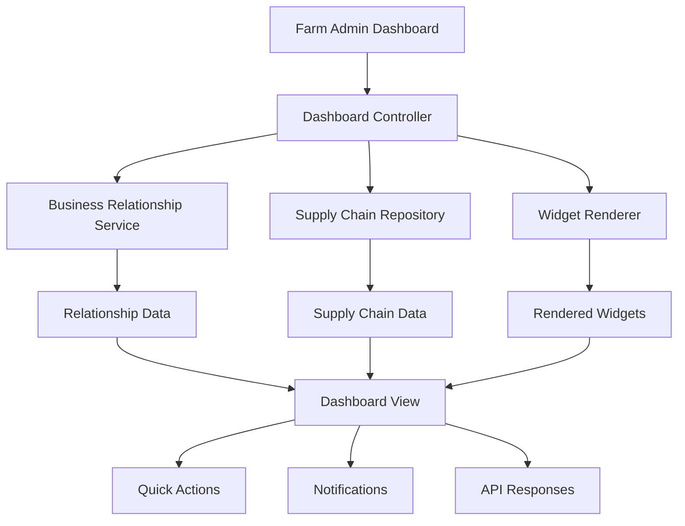

# Farm Admin Dashboard Implementation

## Overview

The Farm Admin Dashboard is the central management interface for Farm Admins (Business Owners) in the FarmTally system. It provides comprehensive oversight of business relationships, supply chain operations, field management, and service provider coordination.

## Requirements Addressed

This implementation addresses the following requirements:

- **4.1**: Business relationship overview and central management
- **4.2**: Field Manager and service provider management interfaces  
- **4.3**: Business relationship management functionality
- **4.4**: Supply chain status display
- **4.5**: Supply chain monitoring and coordination
- **5.1, 5.2, 5.3**: Field Manager invitation system
- **8.2, 8.3**: Service provider relationship approval workflow

## Architecture

### Core Components

1. **FarmAdminDashboardComponent** - Main dashboard interface and data orchestration
2. **FarmAdminRoutes** - API endpoints for dashboard functionality
3. **DashboardController** - Dashboard configuration and data management
4. **BusinessRelationshipService** - Business relationship operations
5. **SupplyChainRepository** - Supply chain data access

### Key Features

#### 1. Business Relationships Overview (Requirement 4.1)

```typescript
interface RelationshipOverview {
  totalActive: number;
  totalPending: number;
  fieldManagers: number;
  farmers: number;
  lorryAgencies: number;
  equipmentProviders: number;
  inputSuppliers: number;
  dealers: number;
  recentlyEstablished: number;
}
```

**Features:**
- Real-time count of active and pending relationships
- Breakdown by relationship type
- Recent activity tracking
- Visual overview of business network

#### 2. Field Manager Management (Requirements 4.2, 4.3, 5.1-5.3)

```typescript
interface FieldManagerManagement {
  activeManagers: FieldManagerSummary[];
  pendingInvitations: InvitationSummary[];
  recentActivity: FieldActivity[];
}
```

**Features:**
- Magic link invitation system
- Active Field Manager monitoring
- Invitation status tracking
- Field operation activity logs

#### 3. Service Provider Management (Requirements 4.2, 4.3, 8.2, 8.3)

```typescript
interface ServiceProviderManagement {
  providersByType: Record<RelationshipType, ServiceProviderSummary[]>;
  pendingRequests: RelationshipRequest[];
  recentCommunications: CommunicationSummary[];
}
```

**Features:**
- Relationship request approval workflow
- Provider categorization by type
- Communication tracking
- Business relationship termination

#### 4. Supply Chain Status (Requirements 4.4, 4.5)

```typescript
interface SupplyChainStatus {
  overview: SupplyChainOverview;
  commodityDeliveries: CommodityDeliverySummary[];
  recentTransactions: TransactionSummary[];
  upcomingActivities: UpcomingActivity[];
}
```

**Features:**
- Commodity delivery tracking
- Transaction monitoring
- Payment status oversight
- Upcoming activity scheduling
- Overdue delivery alerts

## API Endpoints

### Dashboard Management

```typescript
// Load complete dashboard
GET /api/farm-admin/{farmAdminId}/dashboard

// Refresh dashboard data
POST /api/farm-admin/{farmAdminId}/dashboard/refresh
```

### Business Relationships

```typescript
// Get business relationships overview
GET /api/farm-admin/{farmAdminId}/relationships

// Get pending relationship requests
GET /api/farm-admin/{farmAdminId}/relationships/pending

// Approve relationship request
POST /api/farm-admin/{farmAdminId}/relationships/{relationshipId}/approve

// Reject relationship request
POST /api/farm-admin/{farmAdminId}/relationships/{relationshipId}/reject
```

### Field Manager Management

```typescript
// Get Field Managers
GET /api/farm-admin/{farmAdminId}/field-managers

// Invite Field Manager
POST /api/farm-admin/{farmAdminId}/field-managers/invite

// Get pending invitations
GET /api/farm-admin/{farmAdminId}/invitations/pending
```

### Supply Chain

```typescript
// Get supply chain status
GET /api/farm-admin/{farmAdminId}/supply-chain

// Get commodity deliveries (with filters)
GET /api/farm-admin/{farmAdminId}/supply-chain/deliveries?status=pending&overdue=true

// Get transactions (with filters)
GET /api/farm-admin/{farmAdminId}/supply-chain/transactions?status=pending
```

## Dashboard Widgets

The Farm Admin dashboard includes the following widgets:

### 1. Business Relationships Overview Widget
- **Type**: `RELATIONSHIP_OVERVIEW`
- **Data Source**: `business-relationships`
- **Features**: Active/pending counts, relationship type breakdown, quick actions

### 2. Supply Chain Status Widget
- **Type**: `SUPPLY_CHAIN_STATUS`
- **Data Source**: `supply-chain`
- **Features**: Delivery tracking, transaction monitoring, activity timeline

### 3. Field Manager Overview Widget
- **Type**: `FIELD_OPERATIONS`
- **Data Source**: `field-managers`
- **Features**: Active manager list, invitation status, recent activities

### 4. Pending Relationship Requests Widget
- **Type**: `PENDING_APPROVALS`
- **Data Source**: `relationship-requests`
- **Features**: Request queue, urgent indicators, quick approval actions

### 5. Recent Transactions Widget
- **Type**: `RECENT_TRANSACTIONS`
- **Data Source**: `transactions`
- **Features**: Transaction history, payment status, partner information

### 6. Commodity Deliveries Widget
- **Type**: `COMMODITY_SCHEDULE`
- **Data Source**: `commodity-deliveries`
- **Features**: Delivery schedule, overdue alerts, completion tracking

## Quick Actions

The dashboard provides contextual quick actions based on current data:

### High Priority Actions
- Review urgent relationship requests (>7 days pending)
- Address overdue deliveries
- Resolve payment issues

### Medium Priority Actions
- Review new relationship requests
- Invite Field Managers
- Monitor pending payments

### Low Priority Actions
- Manage business network
- View system statistics
- Access communication logs

## Notifications

The system generates intelligent notifications for:

### Relationship Management
- New relationship requests
- Urgent pending requests (>7 days)
- Relationship status changes

### Supply Chain Operations
- Overdue deliveries
- Payment due dates
- Recent supply chain activity

### Field Management
- Field Manager activity updates
- Invitation status changes
- Field operation alerts

## Data Flow



## Security and Permissions

### Role-Based Access Control
- Only users with `FARM_ADMIN` role can access the dashboard
- Relationship data is filtered by Farm Admin ownership
- Supply chain data is scoped to Farm Admin's operations

### Permission Requirements
```typescript
const farmAdminPermissions = [
  'relationships:read',
  'relationships:create', 
  'relationships:approve',
  'relationships:reject',
  'field-management:read',
  'field-management:invite',
  'supply-chain:read',
  'transactions:read',
  'commodity:read'
];
```

## Error Handling

### Validation Errors
- Invalid Farm Admin ID
- Missing required parameters
- Invalid email addresses for invitations
- Empty rejection/termination reasons

### Business Logic Errors
- Unauthorized access attempts
- Duplicate relationship requests
- Expired invitation tokens
- Invalid relationship status transitions

### System Errors
- Database connection failures
- External service unavailability
- Data consistency issues

## Performance Considerations

### Data Loading Optimization
- Lazy loading of widget data
- Pagination for large datasets
- Caching of frequently accessed data
- Efficient database queries

### Real-time Updates
- WebSocket connections for live updates
- Event-driven notification system
- Incremental data refresh
- Optimistic UI updates

## Testing Strategy

### Unit Tests
- Dashboard component functionality
- API endpoint validation
- Business logic verification
- Error handling scenarios

### Integration Tests
- End-to-end dashboard loading
- Relationship management workflows
- Supply chain data integration
- Widget rendering pipeline

### Performance Tests
- Dashboard load times
- Large dataset handling
- Concurrent user scenarios
- Memory usage optimization

## Usage Examples

### Loading Dashboard
```typescript
const farmAdminRoutes = new FarmAdminRoutesImpl(/* dependencies */);
const result = await farmAdminRoutes.getDashboard('farm-admin-123');

if (result.success) {
  console.log('Dashboard loaded:', result.data);
}
```

### Inviting Field Manager
```typescript
const inviteResult = await farmAdminRoutes.inviteFieldManager(
  'farm-admin-123',
  'fieldmanager@example.com'
);

if (inviteResult.success) {
  console.log('Invitation sent:', inviteResult.message);
}
```

### Approving Relationship Request
```typescript
const approveResult = await farmAdminRoutes.approveRelationshipRequest(
  'relationship-456',
  'farm-admin-123'
);

if (approveResult.success) {
  console.log('Request approved:', approveResult.message);
}
```

## Future Enhancements

### Planned Features
- Advanced analytics and reporting
- Predictive supply chain insights
- Automated relationship matching
- Mobile dashboard optimization
- Real-time collaboration tools

### Scalability Improvements
- Microservice architecture
- Event sourcing implementation
- Advanced caching strategies
- Database sharding
- CDN integration

## Conclusion

The Farm Admin Dashboard provides a comprehensive central management interface that enables Farm Admins to effectively coordinate their agricultural business operations. It successfully implements all required functionality for business relationship management, supply chain oversight, and field management coordination while maintaining security, performance, and usability standards.